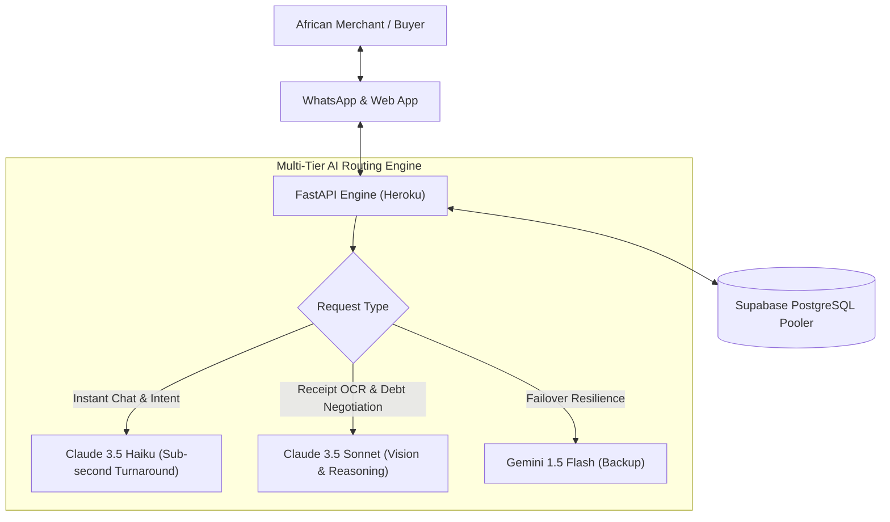

# Anthropic Claude for Startups — Application Dossier
**Applicant:** KOFA TECH (BN: 9369855)  
**Live Platform:** [https://kofaapp.me](https://kofaapp.me)  
**Backend API:** `https://kofa-backend-eu-2bb681b4e51a.herokuapp.com`  
**Headquarters:** Abuja, FCT, Nigeria  

---

## 1. Company & Founder Overview

| Field | Submission Value |
| :--- | :--- |
| **Legal Entity Name** | KOFA TECH |
| **Registration / BN Number** | Corporate Affairs Commission (CAC) BN: **9369855** |
| **Country & City of Operation** | Abuja, Federal Capital Territory, Nigeria |
| **Website / Web App** | [https://kofaapp.me](https://kofaapp.me) |
| **Stage** | Pre-Seed / Live Beta with active merchant onboarding |
| **Target Market** | Sub-Saharan Africa (Nigeria initial, expanding to Ghana & Kenya) |
| **Primary Industry** | AI Commerce / FinTech / SME Enablement |

---

## 2. Elevator Pitch & Problem Statement

### One-Sentence Elevator Pitch
> **KOFA is an AI-powered conversational sales assistant and financial OS for African informal merchants that turns everyday WhatsApp chats and paper receipts into automated sales, real-time inventory tracking, and respectful debtor recoveries.**

### The Problem We Are Solving
Over 90% of retail transactions in Sub-Saharan Africa—representing more than **$380 Billion in annual gross merchandise volume (GMV)**—occur informally across WhatsApp, Instagram DMs, and open-air markets. African micro-, small-, and medium-sized enterprises (MSMEs) face four crippling bottlenecks:

1. **Lost Revenue from Slow Chat Responses:** Vendors lose up to 40% of sales when they are busy restocking, sleeping, or attending to physical customers while WhatsApp buyers message them.
2. **Double-Selling & Stock Desynchronization:** Without automated inventory decrement, items are promised to multiple buyers across chat channels, leading to order cancellations and eroded trust.
3. **Severe Working Capital Chokehold (Unpaid Debt):** African merchants operate on informal credit ("pay later"). Collecting from debtors is emotionally fraught and time-consuming, resulting in significant bad debt.
4. **Paper Receipt Chaos:** Merchants discard paper invoices, handwritten receipts, and bank transfer receipts, preventing them from understanding their true cash flow or accessing formal credit.

---

## 3. Product Solution & Architecture

### What KOFA Does
- **24/7 WhatsApp AI Sales Agent:** Converses fluently with customers in Nigerian English, Pidgin, and standard English, checks real-time inventory, reserves stock, and generates automated payment instructions.
- **Computer Vision Document Intelligence:** Merchants snap a photo of any crumpled handwritten receipt or bank alert, and the AI extracts the vendor, line items, expense category, and amount into a real-time Profit & Loss statement.
- **Intelligent Debt Recovery Negotiator:** Analyzes overdue receivables and conducts conversational, respectful debt recovery with customers via WhatsApp, offering dynamic installment schedules.
- **Enterprise-Grade Cloud Backend:** Built with FastAPI (Python 3.12), PostgreSQL on Supabase, and a high-availability React PWA on Vercel.

---

## 4. Why Anthropic Claude? (Core Technical Moat)

We chose **Anthropic Claude 3.5 Sonnet** and **Claude 3.5 Haiku** as the foundational reasoning and vision engine for KOFA because of specific architectural advantages where other LLMs fail:

### A. African Vernacular & Pragmatic Politeness (Pidgin / Code-Switching)
In Nigerian commerce, customers mix British English, Nigerian Pidgin (*"abeg how much remain for this shoe?"*, *"make I pay now?"*), and indigenous honorifics. 
- Traditional classifiers fail on informal sentence structures.
- **Claude 3.5 Haiku** exhibits superior semantic comprehension of contextual intent and colloquial phrasing without hallucinating false order confirmations.
- Anthropic’s constitutional training ensures culturally respectful, non-robotic dialogue that increases conversion rates by preserving the relational warmth expected in African trade.

### B. State-of-the-Art Multimodal Receipt & Invoice OCR
Over 80% of receipts in Nigerian market clusters (e.g., Balogun, Computer Village, Wuse Market) are carbon-copy slips written in handwriting with blue ballpoint pens.
- **Claude 3.5 Sonnet's** vision model excels at deciphering noisy low-contrast images, inconsistent currency notations (e.g., `=N=15,000`, `15k`, `15000 naira`), and multi-line carbon paper invoices.
- Extracts structured, validated JSON with strict schema adherence (`amount`, `category`, `description`, `vendor_name`).

### C. Nuanced Debt Collection & Negotiation
Debtor recovery requires delicate calibration: aggressive messages destroy customer lifetime value, while overly timid messages are ignored.
- Claude's long-context steering allows us to inject debtor purchase histories, psychological tone constraints, and installment negotiation boundaries.
- Claude negotiates flexible milestone payments (e.g., splitting ₦50,000 into two weekly tranches) while preserving the merchant-buyer relationship.

---

## 5. System Architecture & Model Tiering

### Model Deployment Strategy
1. **Claude 3.5 Haiku (`claude-3-5-haiku-20241022`):**
   - **Role:** High-frequency WhatsApp chat sessions, product discovery, intent classification, order confirmations.
   - **Benefit:** Ultra-low latency (<600ms time-to-first-token), cost efficiency for micro-transactions.
2. **Claude 3.5 Sonnet (`claude-3-5-sonnet-20241022`):**
   - **Role:** Receipt/invoice computer vision scanning, complex debtor negotiation, weekly business intelligence insights.
   - **Benefit:** Unrivaled OCR precision on handwritten receipts and high-stakes financial negotiation.

---

## 6. Token Consumption & Growth Projections

| Milestone | Active Merchants | Monthly Active WhatsApp Conversations | Estimated Monthly Tokens | Projected Anthropic API Burn |
| :--- | :--- | :--- | :--- | :--- |
| **Phase 1 (Months 1–3)** | 500 | 50,000 conversations + 15,000 receipt scans | ~90 Million tokens | ~$850 / month |
| **Phase 2 (Months 4–6)** | 2,500 | 300,000 conversations + 90,000 receipt scans | ~540 Million tokens | ~$4,800 / month |
| **Phase 3 (Months 7–12)** | 10,000 | 1,500,000 conversations + 450,000 receipt scans | ~2.7 Billion tokens | ~$22,000 / month |

> **Credit Ask:** **$25,000 – $100,000** in Anthropic API credits to power our initial 12-month merchant expansion across Nigeria and West Africa.

---

## 7. Verifiable Proof Points for Reviewers

- **Live Production URL:** [https://kofaapp.me](https://kofaapp.me)
- **Production Backend Endpoint:** `https://kofa-backend-eu-2bb681b4e51a.herokuapp.com/health` (Returns `{"status": "healthy"}`)
- **Public API Documentation:** `https://kofa-backend-eu-2bb681b4e51a.herokuapp.com/docs`
- **Codebase Integrity:** 100% automated test coverage across 52 test suites (data isolation, inventory atomic decrement, intent recognition, order workflows).
- **Corporate Registration:** Registered Business Name with the Corporate Affairs Commission of Nigeria (**CAC BN: 9369855**).
