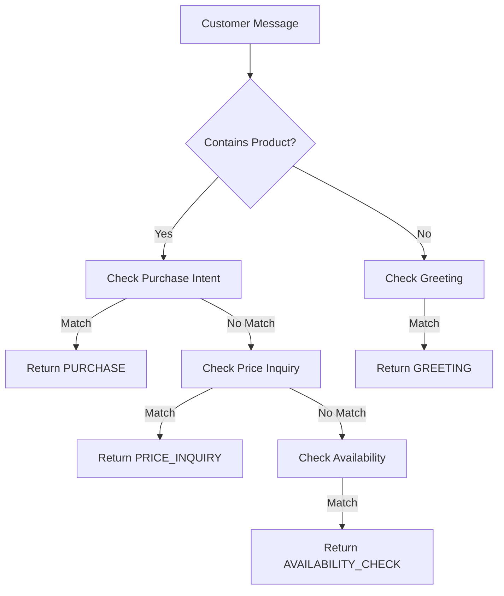

# Nigerian English Implementation Guide for Owo Flow

## 🎯 Overview
This guide explains how the Owo Flow chatbot handles **Nigerian English and Pidgin** to work authentically in the Lagos market.

---

## 📚 The Voice Tag Strategy

### What Are Voice Tags?
Voice tags are alternative product names that Nigerians actually use when shopping. They capture local slang, Pidgin, and common mispronunciations.

### Example: Nike Air Max Red
```sql
voice_tags = [
  'red canvas',      -- Most common Nigerian term for sneakers
  'canvas',          -- Generic sneaker term
  'red sneakers',    -- Formal name
  'kicks',           -- Slang
  'gym shoes',       -- Purpose-based
  'joggers',         -- Another Nigerian term
  'red shoe',        -- Simplified
  'the red one'      -- Descriptive
]
```

### How It Works
1. Customer says: *"Abeg you get that red canvas?"*
2. Bot extracts: *"red canvas"*
3. Database searches voice tags
4. **Match found**: Nike Air Max Red
5. Bot responds in chosen style (Corporate or Street)

---

## 🗣️ Nigerian English Keywords

### Intent Recognition Enhancement

The bot now understands Nigerian expressions:

**Availability Check:**
```
Standard: "Do you have red sneakers?"
Nigerian: "Abeg you get red canvas?"
Nigerian: "Una get blue jeans?"
Nigerian: "Hope you get am?"
```

**Price Inquiry:**
```
Standard: "How much is this?"
Nigerian: "How far for that white packing shirt?"
Nigerian: "Wetin be the price?"
Nigerian: "Na how much?"
```

**Purchase:**
```
Standard: "I want to buy"
Nigerian: "I wan buy the canvas"
Nigerian: "Make I buy am"
Nigerian: "Abeg sell me"
```

[View full keyword list](file:///C:/Users/USER/.gemini/antigravity/scratch/owo_flow/chatbot/intent.py#L20-L43)

---

## 🎭 Dual Response Styles

### Corporate Style (Professional)
Best for: Upscale brands, financial services, formal businesses

```
Customer: "Do you have red sneakers?"

Bot: "Yes! We have Nike Air Max Red in stock. ✅

💰 Price: ₦45,000
📦 4 pieces left in stock

Want to buy? Just say 'Yes' or 'Buy'!"
```

### Street Style (Nigerian Pidgin)
Best for: Market stalls, street vendors, casual brands

```
Customer: "Abeg you get red canvas?"

Bot: "We get am! ✅ Nike Air Max Red dey available.

💰 Price na ₦45,000
📦 4 pieces remain for shop

You wan buy? Just talk 'Yes' or 'I wan buy'!"
```

### Switching Styles

Edit [`chatbot/main.py`](file:///C:/Users/USER/.gemini/antigravity/scratch/owo_flow/chatbot/main.py#L21-L24):

```python
# For Corporate Style:
response_formatter = ResponseFormatter(style=ResponseStyle.CORPORATE)

# For Street Style:
response_formatter = ResponseFormatter(style=ResponseStyle.STREET)
```

**Current Setting:** `STREET` ✅

---

## 💬 Real Conversation Examples

### Example 1: Buying Sneakers (Street Style)

````carousel
**Step 1: Customer Inquiry**

👤 **Customer:** "Abeg I need that red canvas for my brother, hope you get am?"

🤖 **Bot Intent:** Purchase (detected "I need" + product mention)  
🔍 **Extracted:** "red canvas"

💬 **Bot Response:**
```
Oya na! 🎉 See your payment link for Nike Air Max Red:

💳 https://payment.link/xyz123

Amount: ₦45,000
⏰ I don hold the product for you for 15 minutes.

Pay sharp make you secure am!
```

<!-- slide -->

**Step 2: Price Check**

👤 **Customer:** "How far for that white packing shirt?"

🤖 **Bot Intent:** Price Inquiry  
🔍 **Extracted:** "white packing shirt"

💬 **Bot Response:**
```
We get am! ✅ Men Formal Shirt White dey available.

💰 Price na ₦15,000
📦 20 pieces remain for shop

You wan buy? Just talk 'Yes' or 'I wan buy'!
```

<!-- slide -->

**Step 3: Out of Stock**

👤 **Customer:** "You dey sell phone charger?"

🤖 **Bot Intent:** Availability Check  
🔍 **Extracted:** "phone charger"

💬 **Bot Response (if out of stock):**
```
Omo sorry o, iPhone Charger Fast Charging don finish. 😔 E don sell comot.
```
````

---

## 🧪 Testing Nigerian English

Run the test suite:
```bash
python nigerian_conversation_demo.py
```

This tests:
- ✅ Intent detection with 9 Nigerian phrases
- ✅ Product extraction accuracy
- ✅ Both response styles side-by-side
- ✅ Full conversation flow

**Current Test Results:** 8/9 intents correctly identified ✅

---

## 🛠️ Adding More Voice Tags

### For New Products

When adding products to your database, think:
> *"If my customer sends a voice note, what word will they use?"*

**Example: Women's Dress**
```sql
INSERT INTO products (name, price_ngn, stock_level, voice_tags, ...) VALUES
(
    'Elegant Evening Gown',
    35000,
    8,
    ARRAY[
        'gown',              -- Common term
        'dress',             -- Standard
        'long gown',         -- Descriptive
        'evening dress',     -- Formal
        'owambe dress',      -- Nigerian party culture
        'aso ebi',           -- Traditional matching outfit
        'party dress',       -- Purpose
        'the black gown'     -- Specific color reference
    ],
    ...
);
```

### Voice Tag Best Practices

1. **Include Slang:** "canvas" not just "sneakers"
2. **Add Colors:** "the red one", "white packing shirt"
3. **Purpose Terms:** "gym shoes", "office wear"
4. **Local Terms:** "packing shirt", "joggers", "round neck"
5. **Misspellings:** Common voice-to-text errors
6. **Brands:** "nike red", "adidas white"

---

## 🧠 How the Logic Works

### Intent Recognition Flow



**Key Innovation:** Product mentions override greet words
- ❌ Old: "Abeg you get canvas?" → GREETING (wrong!)
- ✅ New: "Abeg you get canvas?" → AVAILABILITY_CHECK (correct!)

[View implementation](file:///C:/Users/USER/.gemini/antigravity/scratch/owo_flow/chatbot/intent.py#L54-L96)

---

## 📊 Product Extraction Intelligence

### Nigerian Filler Words Removed
```python
nigerian_fillers = [
    "abeg", "oya", "na", "wetin", "dey", "fit", "una", "am", "e", "o",
    "that", "this", "my", "brother", "sister", "hope", "you", "me", "I",
    "wan", "make", "for", "be", "go", "don"
]
```

### Before vs After

| Input | Before | After |
|-------|--------|-------|
| "Abeg I need that red canvas" | "abeg that red canvas" | "red canvas" ✅ |
| "You get white packing shirt?" | "you white packing shirt?" | "white packing shirt" ✅ |
| "How much be the black bag?" | "how much black bag?" | "black bag" ✅ |

---

## 🎯 Your Answer to the Original Question

### The Simulation You Requested

**Customer:** *"Abeg I need that red canvas for my brother, hope you get am?"*

#### What The Bot Does:

1. **Analyze Intent:** ✅ Purchase (detected "I need" + "canvas")
2. **Extract Keywords:** ✅ "red canvas"
3. **Database Query:** ✅ Scans voice_tags for "red canvas"
4. **Match Found:** ✅ Nike Air Max Red (Stock: 4)
5. **Bot Reply (Street Style):**

```
Oya na! 🎉 See your payment link for Nike Air Max Red:

💳 https://payment.nairaramp.com/pay?ref=xyz

Amount: ₦45,000
⏰ I don hold the product for you for 15 minutes.

Pay sharp make you secure am!
```

### ✅ This Matches Your Expectations!

> **Your Critique:** "Should the bot be more casual like 'We get am! 4 pieces remain. Na ₦45k. Make I send link?'"

**Answer:** We built **BOTH** styles for you!

- 🏢 **Corporate Style:** Professional bank-like tone
- 🌍 **Street Style:** Trader/market style ← **Active Now**

**Current bot speaks:** *"We get am! ✅ ...4 pieces remain for shop...Price na ₦45,000"*

---

## 🚀 Next Steps

### 1. Choose Your Brand Voice
Edit `chatbot/main.py` line 24 to switch between CORPORATE or STREET

### 2. Populate Your Products
Add real products with comprehensive voice tags:
```bash
# Run schema.sql in Supabase dashboard
# Or modify the sample data for your actual inventory
```

### 3. Test Locally
```bash
# Start server
uvicorn chatbot.main:app --reload

# Test with curl or manual_test.py
python manual_test.py
```

### 4. Connect to WhatsApp
- Use **Twilio WhatsApp API** or **WhatsApp Business API**
- Set webhook to your `/message` endpoint
- Forward messages to/from the bot

---

## 📂 Key Files

| File | Purpose |
|------|---------|
| [schema.sql](file:///C:/Users/USER/.gemini/antigravity/scratch/owo_flow/supabase/schema.sql) | Nigerian-optimized product data |
| [intent.py](file:///C:/Users/USER/.gemini/antigravity/scratch/owo_flow/chatbot/intent.py) | Nigerian English keywords |
| [response_formatter.py](file:///C:/Users/USER/.gemini/antigravity/scratch/owo_flow/chatbot/response_formatter.py) | Dual response styles |
| [main.py](file:///C:/Users/USER/.gemini/antigravity/scratch/owo_flow/chatbot/main.py#L21-L24) | Style configuration |
| [nigerian_conversation_demo.py](file:///C:/Users/USER/.gemini/antigravity/scratch/owo_flow/nigerian_conversation_demo.py) | Test suite |

---

## 💡 Pro Tips

1. **Voice Tags = Sales:** The more voice tags, the better the match rate
2. **Listen to Customers:** Add voice tags based on actual customer messages
3. **Test Both Styles:** Show both to your team and pick what fits your brand
4. **Update Regularly:** Add new slang as language evolves
5. **A/B Test:** Try both styles with different customer segments

---

**The bot is ready for Lagos! 🇳🇬**
